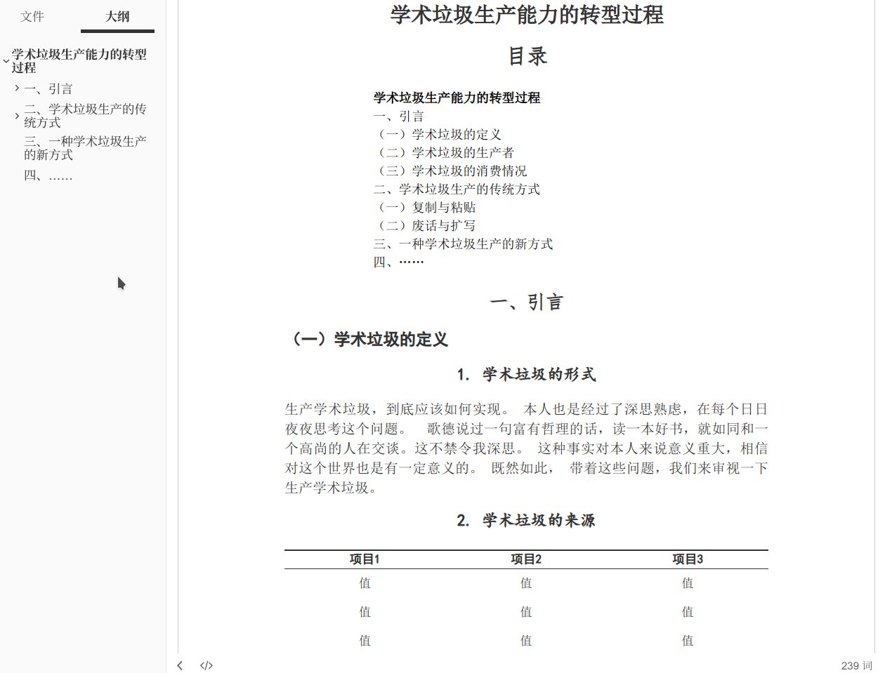
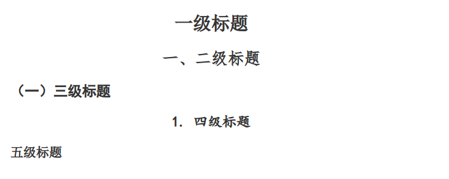
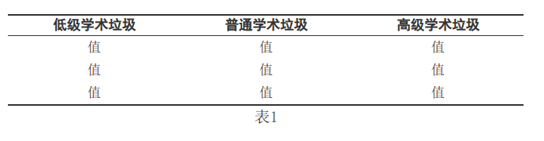
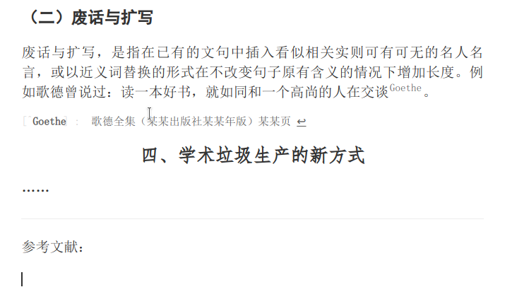
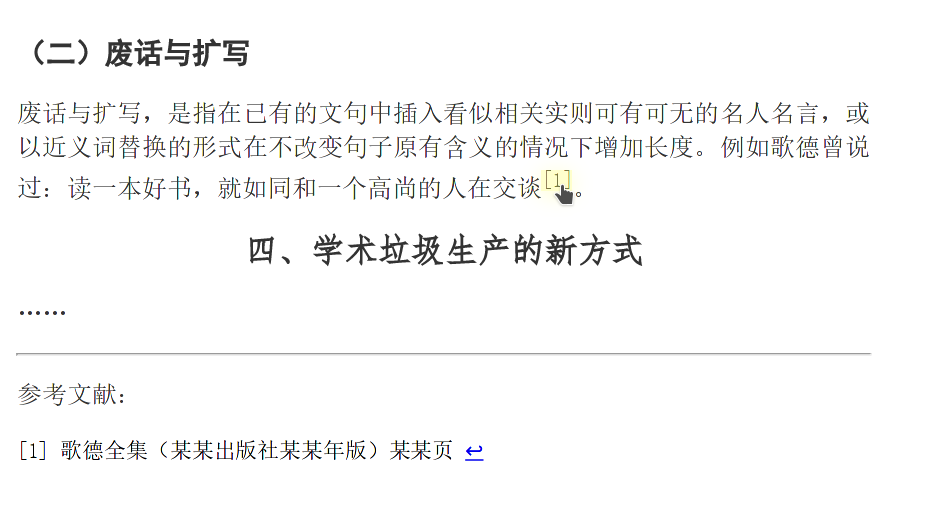
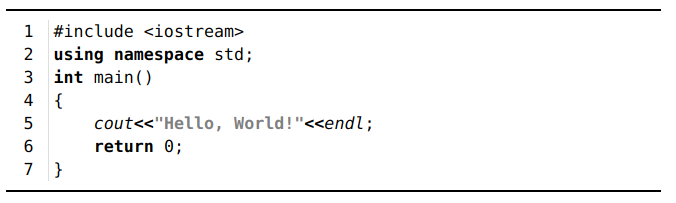
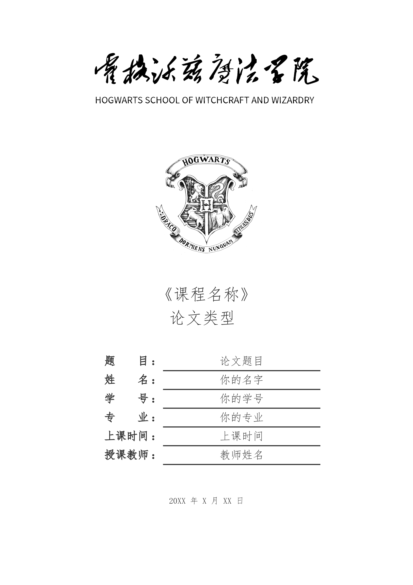

# typora-theme-essay_cn

一个简洁的、为中文课程论文排版设计的[Typora](https://typora.io/)主题。



## 主题安装

可参见[Typora官方主题文档](http://support.typora.io/About-Themes/)

太长不看版:

0. [在此处](https://github.com/du33169/typora-theme-essay_cn/releases/latest)下载文件，并解压缩
1. 打开Typora
2. 菜单栏“文件”选项卡-偏好设置（<kbd>Ctrl</kbd> +<kbd>,</kbd>）
3. 外观-主题-打开主题文件夹themes
4. 将下载的essay.css文件放入此文件夹
5. 重启Typora，打开论文.md文件
6. 菜单栏“主题”选项卡-Essay

## 特点

1. A4页面设定，编辑器内所见即所得（除footnote外）
2. 各级标题自动编号，具有合适的不同字体
3. 图表自动编号（参考[Typora支持文档](https://support.typora.io/Auto-Numbering/)，图片编号在导出文件中暂无法显示）
4. 表格采用三线表
5. [TOC]目录样式调整，不会有突兀的蓝色下划线
6. footnote尾注呈现参考文献格式（自动排序，且可以任意指定标识符）
7. 代码块采用更适合打印和纸质阅读的黑白灰样式

关于上述特点及其CSS样式，还可见[详细介绍](https://du33169.tech/projects/typoraTheme--Essay.html)。

## 文件说明

- essay.css:普通课程论文可用主题
- article.css:仿学术期刊主题（更新没那么及时）
- cover_template/cover_template.md：简单的论文封面模板
- essay.docx: 用于导出为word文档的模板

## 细节展示

### 各级标题及自动编号



### 三线表及自动编号



### 尾注参考文献样式

#### 编辑器内

如下是编辑器内样式，可以注意到尾注的标识符可以自定便于查找，而且内容可以直接附在引用位置附近便于编辑；



#### 导出效果

如下是导出为PDF后的效果，可以发现自定义的标识符已经自动转换为标号，引用的内容也自动归集到了文章最后：



### 代码块样式



## 封面模板

cover_template目录下的cover_template.md为论文封面模板，利用了Markdown对内嵌HTML的支持。复制其中的HTML粘贴到你的Markdown文档开头，并修改校标、校名、论文各项信息，导出时即可拥有美观的封面页。（设置了自动分页，正文内容不会挤到封面中）

### 效果图



## Word转换模板

essay.docx是按本主题设计的word模板文件，可以使用pandoc将markdown源文件导出为**基本**符合主题格式的docx文件，命令如下(参见[pandoc's user guide](https://pandoc.org/MANUAL.html#option--reference-doc))：

```bash
pandoc -i xxx.md --reference-doc essay.docx xxx.docx
```

也可以利用新版typora的自定义导出功能将本命令添加到导出菜单中。

**注意**：导出后请打开导出的word文档检查并调整，pandoc对于公式块、表格、引用等的处理可能不尽如人意。另外在使用该方法时，pandoc会读取essay.docx中设定的**样式**，并应用到输出的文档中。因此essay.docx中显示的可见内容只是效果展示，直接编辑它们并不会改变输出的结果，如有需要请更改样式。

## 已知问题

### 图片自动编号在导出PDF中无法显示

图表编号样式使用CSS中的伪元素实现，图片导出时仅为HTML标签，该标签不支持伪元素。

### article样式中公式符号重叠[issue#2](https://github.com/du33169/typora-theme-essay_cn/issues/2)

该问题只在CSS样式`column-count:2;`生效时出现，猜测是Typora使用的mathjax版本问题。

